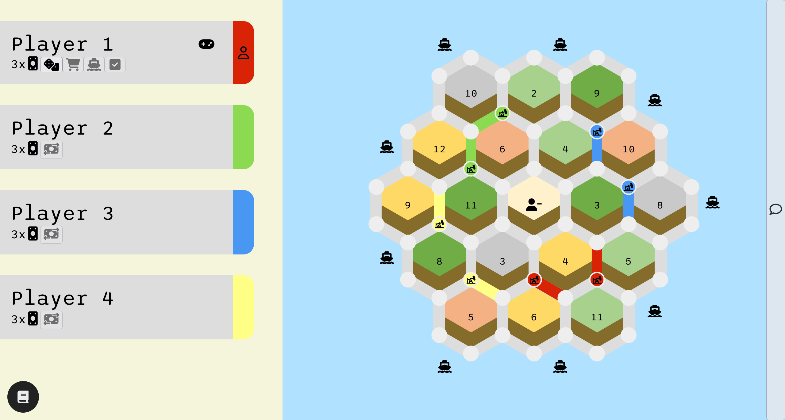

# Catan ⬡

**➵ [Firebase site](https://catan-5ad96.firebaseapp.com)**

### About

*[Catan](https://en.wikipedia.org/wiki/Catan)*, also known as *The Settlers of Catan* is a game of monopoly on the weirdly hexagonal island of Catan. Players compete for resources, building settlements and infrastructure while racing to reach 10 victory points.

This project is an adaptation of the basic 4-player setup. The entire board is made with plain CSS, and online functionality has been implemented with Firebase.

### How to Play

1. The host creates a room and shares the room ID
2. Other players can join with that room ID
3. First to reach 10 Victory Points wins the game!

Refer to the rules at the bottom left hand corner.